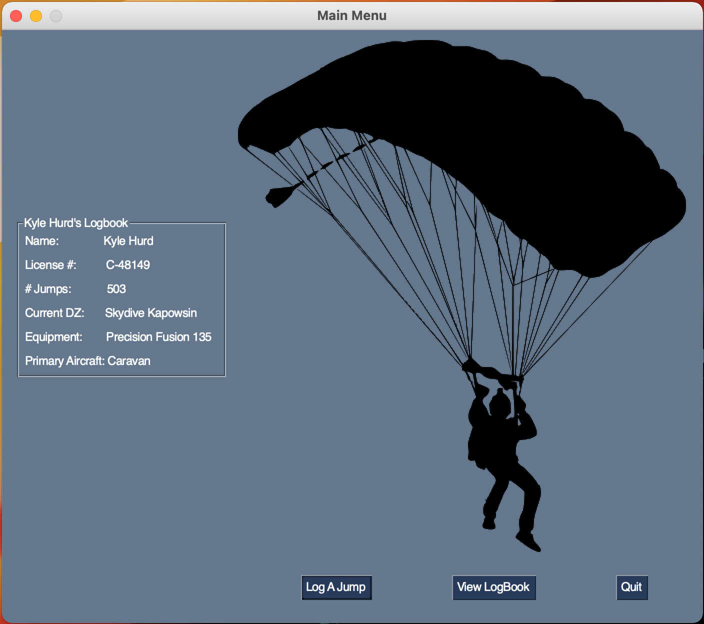
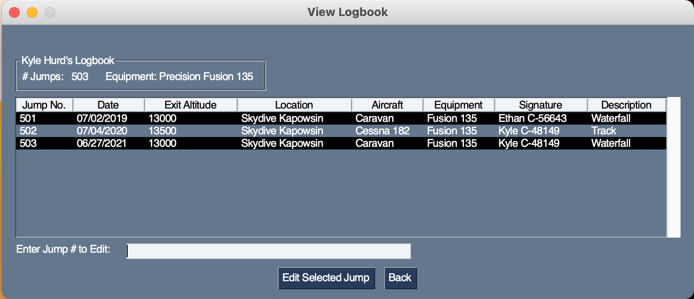
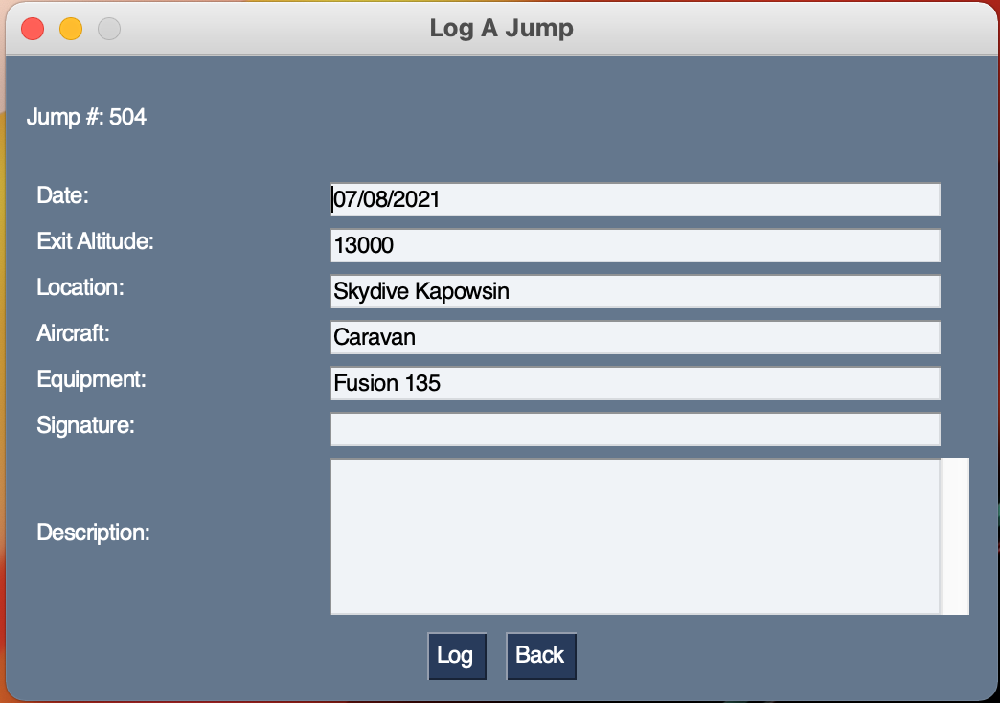

# Skydive LogBook

Welcome to my Skydive Logbook. This program uses Python to provide a convenient way to digitize your jumps. View, edit, and log new jumps quickly with the default jump information automatically filled for your next jump.

# Requirements

- Tested on Python3.9
- pip install the requirements.txt. You currently only need PySimpleGUI.

# Images

